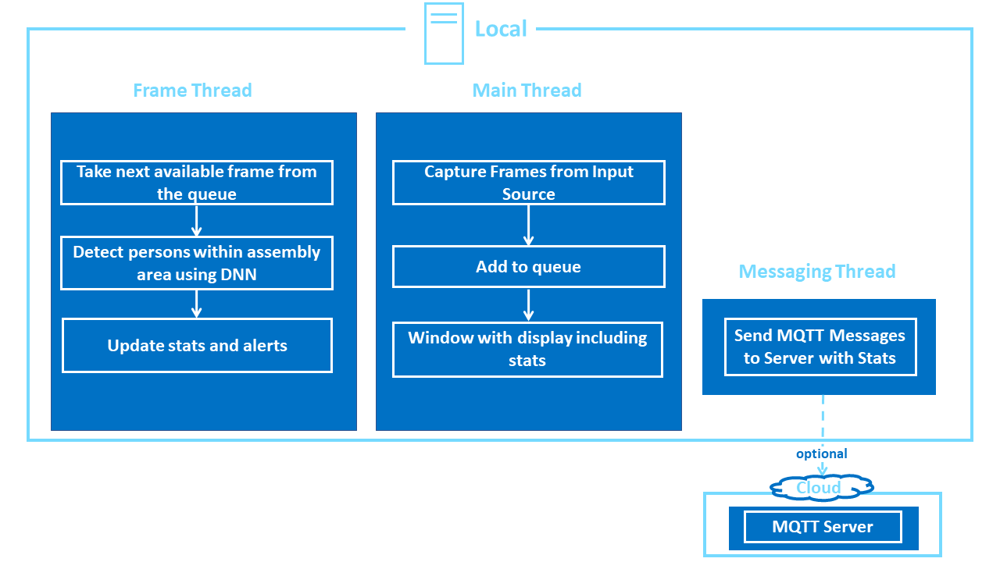

# DISCONTINUATION OF PROJECT #
This project will no longer be maintained by Intel.
Intel has ceased development and contributions including, but not limited to, maintenance, bug fixes, new releases, or updates, to this project.
Intel no longer accepts patches to this project.
# Restricted Zone Notifier

| Details            |              |
|-----------------------|---------------|
| Target OS:            |  Ubuntu\* 18.04 LTS   |
| Programming Language: |  C++ |
| Time to Complete:    |  45 min     |


## What it does
This application is designed to detect the humans present in a predefined selected assembly line area. If the people enters the marked assembly area, it raises the alert and sends through mqtt. It is intended to demonstrate how to use CV to improve assembly line safety for human operators and factory workers.

## Requirements

### Hardware
* 6th to 8th Generation Intel® Core™ processors with Intel® Iris® Pro graphics or Intel® HD Graphics

### Software
* [Ubuntu\* 18.04 LTS](http://releases.ubuntu.com/18.04/)<br><br>
**Note**: We recommend using a 4.14+ kernel to use this software. Run the following command to determine your kernel version:
    ```
    uname -a
    ```
* OpenCL™ Runtime Package
* Intel® Distribution of OpenVINO™ toolkit 2020 R3 Release

## How it Works

The application uses a video source, such as a camera, to grab frames, and then uses a Deep Neural Network (DNN) to process the data. The network detects persons in the frame, and then if successful it checks if the detected persons are in the indicated off-limits assembly line region.

The data can then optionally be sent to a MQTT machine to machine messaging server, as part of an industrial data analytics system.



The program creates three threads for concurrency:

- Main thread that performs the video i/o
- Worker thread that processes video frames using the deep neural networks
- Worker thread that publishes any MQTT messages

## Setup
### Get the code
Clone the reference implementation
```
sudo apt-get update && sudo apt-get install git
git clone https://github.com/intel-iot-devkit/restricted-zone-notifier-cpp.git 
```

### Install OpenVINO

Refer to [Install Intel® Distribution of OpenVINO™ toolkit for Linux*](https://software.intel.com/en-us/articles/OpenVINO-Install-Linux) to learn how to install and configure the toolkit.

Install the OpenCL™ Runtime Package to run inference on the GPU, as shown in the instructions below. It is not mandatory for CPU inference.

## Other dependencies
**Mosquitto**<br>

Mosquitto is an open source message broker that implements the MQTT protocol. The MQTT protocol provides a lightweight method of carrying out messaging using a publish/subscribe model. 


## Which model to use

This application uses the [pedestrian-detection-adas-0002](https://docs.openvinotoolkit.org/2020.3/_models_intel_pedestrian_detection_adas_0002_description_pedestrian_detection_adas_0002.html) Intel® model, that can be downloaded using the **model downloader**. The **model downloader** downloads the __.xml__ and __.bin__ files that will be used by the application.

To download the models and install the dependencies of the application, run the below command in the `restricted-zone-notifier-cpp` directory:
```
./setup.sh
```

### The Config File

The _resources/config.json_ contains the path of video that will be used by the application as input.

For example:
   ```
   {
       "inputs": [
          {
              "video":"path_to_video/video1.mp4",
          }
       ]
   }
   ```

The `path/to/video` is the path to an input video file.

### Which Input Video to use

The application works with any input video. Sample videos are provided [here](https://github.com/intel-iot-devkit/sample-videos/).

For first-use, we recommend using the [worker-zone-detection](https://github.com/intel-iot-devkit/sample-videos/blob/master/worker-zone-detection.mp4) video.
For example:
   ```
   {
       "inputs": [
          {
              "video":"sample-videos/worker-zone-detection.mp4",
          }
       ]
   }
   ```
If the user wants to use any other video, it can be used by providing the path in the config.json file.

### Using the Camera Stream instead of video

Replace `path/to/video` with the camera ID in the config.json file, where the ID is taken from the video device (the number X in /dev/videoX).

On Ubuntu, to list all available video devices use the following command:

```
ls /dev/video*
```

For example, if the output of above command is __/dev/video0__, then config.json would be:

```
  {
     "inputs": [
        {
           "video":"0"
        }
     ]
   }
```

### Setup the Environment

Configure the environment to use the Intel® Distribution of OpenVINO™ toolkit by exporting environment variables:

```
source /opt/intel/openvino/bin/setupvars.sh
```

__Note__: This command needs to be executed only once in the terminal where the application will be executed. If the terminal is closed, the command needs to be executed again.

### Build the Application

To build , go to the `restricted-zone-notifier-cpp` and run the following commands:
```
mkdir -p build && cd build
cmake ..
make
```
## Run the Application

To see a list of the various options:
```
./monitor -help
```

A user can specify what target device to run on by using the device command-line argument `-d`. If no target device is specified the application will run on the CPU by default.
To run with multiple devices use _-d MULTI:device1,device2_. For example: _-d MULTI:CPU,GPU,MYRIAD_

### Run on the CPU

To run the application on CPU, use the following command:
```
./monitor -m=/opt/intel/openvino/deployment_tools/open_model_zoo/tools/downloader/intel/pedestrian-detection-adas-0002/FP32/pedestrian-detection-adas-0002.bin -c=/opt/intel/openvino/deployment_tools/open_model_zoo/tools/downloader/intel/pedestrian-detection-adas-0002/FP32/pedestrian-detection-adas-0002.xml
```

You can select an area to be used as the "off-limits" area by pressing the `c` key once the program is running. A new window will open showing a still image from the video capture device. Drag the mouse from left top corner to cover an area on the plane and once done (a blue rectangle is drawn) press `ENTER` or `SPACE` to proceed with monitoring.

Once you have selected the "off-limits" area the coordinates will be displayed in the terminal window like this:
```
Assembly Area Selection: -x=429 -y=101 -h=619 -w=690
```

You can run the application using those coordinates by using the `-x`, `-y`, `-h`, and `-w` flags to preselect that area.

For example:
```
./monitor -m=/opt/intel/openvino/deployment_tools/open_model_zoo/tools/downloader/intel/pedestrian-detection-adas-0002/FP32/pedestrian-detection-adas-0002.bin -c=/opt/intel/openvino/deployment_tools/open_model_zoo/tools/downloader/intel/pedestrian-detection-adas-0002/FP32/pedestrian-detection-adas-0002.xml -x=429 -y=101 -h=619 -w=690
```

If you do not select or specify an area, the default is to use the entire window as the off limits area.

### Run on the Integrated GPU

This application can take advantage of the hardware acceleration in the Intel® Distribution of OpenVINO™ toolkit by using the `-b` and `-t` parameters.

- To run on the GPU in 32-bit mode, use the following command:
    ```
    ./monitor -m=/opt/intel/openvino/deployment_tools/open_model_zoo/tools/downloader/intel/pedestrian-detection-adas-0002/FP32/pedestrian-detection-adas-0002.bin -c=/opt/intel/openvino/deployment_tools/open_model_zoo/tools/downloader/intel/pedestrian-detection-adas-0002/FP32/pedestrian-detection-adas-0002.xml -b=2 -t=1
    ```

    **FP32**: FP32 is single-precision floating-point arithmetic uses 32 bits to represent numbers. 8 bits for the magnitude and 23 bits for the precision. For more information, [click here](https://en.wikipedia.org/wiki/Single-precision_floating-point_format)<br>

- To run on the GPU in 16-bit mode, use the following command:
    ```
    ./monitor -m=/opt/intel/openvino/deployment_tools/open_model_zoo/tools/downloader/intel/pedestrian-detection-adas-0002/FP16/pedestrian-detection-adas-0002.bin -c=/opt/intel/openvino/deployment_tools/open_model_zoo/tools/downloader/intel/pedestrian-detection-adas-0002/FP16/pedestrian-detection-adas-0002.xml -b=2 -t=2
    ```

    **FP16**: FP16 is half-precision floating-point arithmetic uses 16 bits. 5 bits for the magnitude and 10 bits for the precision. For more information, [click here](https://en.wikipedia.org/wiki/Half-precision_floating-point_format)<br>

**Note:** The Model Loading Time for GPU is quite slow. So to observe the inference for GPU, please try to use longer duration videos.

### Run on the Intel® Neural Compute Stick

To run on the Intel® Neural Compute Stick, use the following command:
```
./monitor -m=/opt/intel/openvino/deployment_tools/open_model_zoo/tools/downloader/intel/pedestrian-detection-adas-0002/FP16/pedestrian-detection-adas-0002.bin -c=/opt/intel/openvino/deployment_tools/open_model_zoo/tools/downloader/intel/pedestrian-detection-adas-0002/FP16/pedestrian-detection-adas-0002.xml -b=2 -t=3
```

### Machine to Machine Messaging with MQTT

If you wish to use a MQTT server to publish data, you should set the following environment variables before running the program:
```
export MQTT_SERVER=localhost:1883
export MQTT_CLIENT_ID=cvservice
```

Change the `MQTT_SERVER` to a value that matches the MQTT server you are connecting to.

You should change the `MQTT_CLIENT_ID` to a unique value for each monitoring station, so you can track the data for individual locations. For example:
```
export MQTT_CLIENT_ID=zone1337
```

If you want to monitor the MQTT messages sent to your local server, and you have the `mosquitto` client utilities installed, you can run the following command on a new terminal while the application is running:
```
mosquitto_sub -t 'machine/zone'
```
